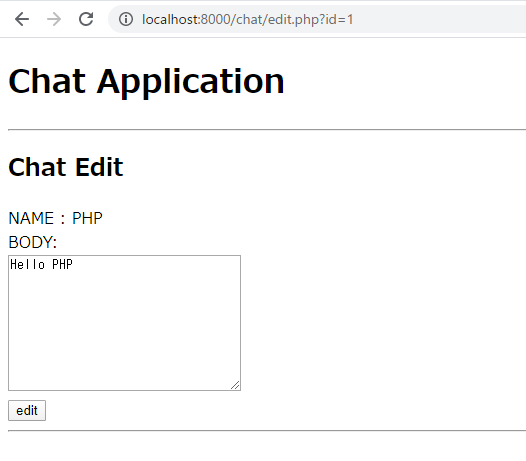
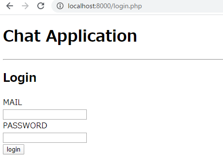

# PHP演習課題　Web編

## 1. GET

以下の要件を満たす、`main.php`を作成せよ。

- `htpp://localhost/main.php`にアクセスすると画面が表示されること
- 会話テーブルの会話の一覧を表示する。
- 会話は新しい順に画面の上部から表示すること
- 以下の画面イメージのような項目を表示すること


- 解答例

```php
<?php

function get_conversations(){
    $pdo = new PDO('mysql:host=localhost:3306;dbname=exercise', 'root', 'root');

    $st = $pdo->prepare("select id, user_name, body, date from conversations order by date desc");

    $st->execute();

    $conversations = $st->fetchAll();

    return $conversations;
}

$conversations = get_conversations()
?>
<!DOCTYPE html>
<html>
<head>
  <meta charset="utf-8">
  <title>Chat Application</title>
</head>
<body>
  <h1>Chat Application</h1>
  <hr>
  <h2>Chat List</h2>
  <ul>
  <?php foreach ($conversations as $conversation) { ?>
    <li>
      <?= htmlspecialchars($conversation['body'].'('.$conversation['user_name'].':'.$conversation['date'].')') ?>
    </li>
  <?php } ?>
  </ul>
  <hr>
</body>
</html>
```

## 2. GET + GETパラメータ

以下の要件を満たす、`edit.php`を作成せよ。さらに`main.php`を変更せよ。

- main.php
    - 各会話の本文の部分をリンクにせよ
    - 各リンクをクリックすると、クリックされた会話のIDをURLパラメーターに設定し`edit.php`に遷移すること



- edit.php
    - リクエストから会話IDを取得すること
    - 会話テーブルからIDが一致する会話を取得すること
    - 取得した会話の本文をテキストボックスに表示すること
    - 以下の画面イメージのような項目を表示すること


- 解答例
    - main.php

    ```php
    <?php

    function get_conversations(){
        $pdo = new PDO('mysql:host=localhost:3306;dbname=exercise', 'root', 'root');
        $st = $pdo->prepare("select id, user_name, body, date from conversations order by date desc");
        $st->execute();
        $conversations = $st->fetchAll();
        return $conversations;
    }
    $conversations = get_conversations()
    ?>
    <!DOCTYPE html>
    <html>
    <head>
    <meta charset="utf-8">
    <title>Chat Application</title>
    </head>
    <body>
    <h1>Chat Application</h1>
    <hr>
    <h2>Chat List</h2>
    <ul>
    <?php foreach ($conversations as $conversation) { ?>
        <li>
        <a href="chat/edit.php?id=<?= $conversation['id']?>"><?= htmlspecialchars($conversation['body']) ?></a><?= htmlspecialchars('('.$conversation['user_name'].':'.$conversation['date'].')') ?>
        </li>
    <?php } ?>
    </ul>
    <hr>
    </body>
    </html>
    ```

    - edit.php

    ```php
    <?php

    function get_conversation($id){
        $pdo = new PDO('mysql:host=localhost:3306;dbname=exercise', 'root', 'root');

        $st = $pdo->prepare("select id, user_name, body, date from conversations where id = :id");

        $st->bindParam(':id', $id);
        $st->execute();

        $conversation = $st->fetch();

        return $conversation;
    }

    $id = $_GET["id"];
    $conversation = get_conversation($id);
    ?>
    <!DOCTYPE html>
    <html>
    <head>
    <meta charset="utf-8">
    <title>Chat Application</title>
    </head>
    <body>
    <h1>Chat Application</h1>
    <hr>
    <h2>Chat Edit</h2>
    <input type="hidden" name="id" value="<?= $conversation['id']?>">
    <label>NAME : <?= htmlspecialchars($conversation['user_name']) ?></label><br>
    <label>BODY:</label><br>
    <textarea name="body" rows="10" cols="30"><?= $conversation['body']?></textarea><br>
    <input type="submit" name="name" value="edit">
    <hr>
    </body>
    </html>
    ```

## 3. POST + Redirect

以下の要件を満たす、`edit_post.php`を作成せよ。また、`edit.php`を変更せよ。

- edit.php
    - 会話の編集を行う
    - 会話IDと本文をメッセージボディ部に格納して、`edit_post.php`に送信すること

- edit_post.php
    - 編集された会話の登録を行う
    - リクエストから、会話IDと本文を取得すること
    - 取得した会話IDの会話の本文を変更すること。その際変更を実行した日時を対象の会話のデータの`date`に格納すること。
    - 登録後は`main.php`に遷移すること。その際、画面を表示した際のURLは`htpp://localhost/main.php`となっていること。

- 解答例
    - edit.php
    
    ```php
    <?php

    function get_conversation($id){
        $pdo = new PDO('mysql:host=localhost:3306;dbname=exercise', 'root', 'root');

        $st = $pdo->prepare("select id, user_name, body, date from conversations where id = :id");

        $st->bindValue(':id', $id);
        $st->execute();

        $conversation = $st->fetch();

        return $conversation;
    }

    $id = $_GET["id"];
    $conversation = get_conversation($id);
    if(is_null($conversation)){
        header('location:main.php');
    }
    ?>
    <!DOCTYPE html>
    <html>
    <head>
    <meta charset="utf-8">
    <title>Chat Application</title>
    </head>
    <body>
    <h1>Chat Application</h1>
    <hr>
    <h2>Chat Edit</h2>
    <form action="edit_post.php" method="post">
        <input type="hidden" name="id" value="<?= $conversation['id']?>">
        <label>NAME : <?= htmlspecialchars($conversation['user_name']) ?></label><br>
        <label>BODY:</label><br>
        <textarea name="body" rows="10" cols="30"><?= $conversation['body']?></textarea><br>
        <input type="submit" name="name" value="edit">
    </form>
    <hr>
    </body>
    </html>
    ```

    - edit_post.php

    ```php
    <?php

    function update_conversation($conversation){

        $pdo = new PDO('mysql:host=localhost:3306;dbname=exercise', 'root', 'root');
    
        $st = $pdo->prepare("update conversations set body = :body, date = now() where id = :id");
    
        $st->bindValue(':id', $conversation['id']);
        $st->bindValue(':body', $conversation['body']);
        $st->execute();
    }

    $id = $_POST['id'];
    $body = $_POST['body'];

    if (is_null($id) || is_null($body)) {
        header('location:/ main.php');
    }

    $conversation = [];
    $conversation['id'] = $id;
    $conversation['body'] = $body;
    update_conversation($conversation);
    header('location:/main.php');
    ```

## 4. 認証機能 + Session

ログイン認証機能を追加します。以下の要件を満たす、`login.php`と`login_controller.php`を作成せよ。
またこれまでに作成したファイルに対して認証機能を追加せよ。

- login.php
    - メールアドレスとパスワードを入力し、メッセージボディ部に格納して、`login_controller.php`に送信すること
    - 以下の画面イメージのような項目を表示すること



- login_controller.php
    - ログイン認証を行うこと
    - リクエストから、メールアドレスとパスワードを取得すること
    - 取得したメールアドレスとパスワードをもとに、`users`テーブルを検索すること
    - ユーザーを検索出来れば、ログイン成功とし、メールアドレスをセッションに格納し、`main.php`に画面遷移すること
    - ユーザーを検索できなければ、ログイン失敗とし、`login.php`に画面遷移すること

- main.php, edit.php
    - 認証機能を追加する
    - セッションからメールアドレスを取得できない場合は、各画面を表示せずログイン画面に遷移すること

- edit_post.php
    - 認証機能を追加する
    - セッションからメールアドレスを取得できない場合は、登録処理を行わずログイン画面に遷移すること

- 解答例
    - login.php

    ```php
    <!DOCTYPE html>
    <html>
    <head>
    <meta charset="utf-8">
    <title>Chat Application</title>
    </head>
    <body>
    <h1>Chat Application</h1>
    <hr>
    <h2>Login</h2>
    <form action="auth/login_controller.php" method="post">
        <label>MAIL</label><br>
        <input type="email" name="mail"><br>
        <label>PASSWORD</label><br>
        <input type="password" name="password"><br>
        <input type="submit" value="login">
    </form>
    </body>
    </html>
    ```

    - login_controller.php

    ```php
    <?php

    function login($mail, $password) {

        $pdo = new PDO('mysql:host=localhost:3306;dbname=exercise', 'root', 'root');
    
        $st = $pdo->prepare("select mail, password from users where mail = :mail and password = :password");
    
        $st->bindParam(':mail', $mail);
        $st->bindParam(':password', $password);
        $st->execute();
    
        $user = $st->fetch();
    
        if($user) {
        return true;
        }
        return false;
    }

    $mail = $_POST['mail'];
    $password = $_POST['password'];

    $result = login($mail, $password);

    if ($result){
        session_start();
        $_SESSION['mail'] = $mail;
        header('location:/main.php');
    } else {
        header('location:/login.php');
    }
    ```

    - main.php

    ```php
    <?php

    function get_conversations(){
        $pdo = new PDO('mysql:host=localhost:3306;dbname=exercise', 'root', 'root');
        $st = $pdo->prepare("select id, user_name, body, date from conversations order by date desc");
        $st->execute();
        $conversations = $st->fetchAll();
        return $conversations;
    }
    session_start();

    $mail = $_SESSION['mail'];

    if (is_null($mail)) {
    header('location:/login.php');
    }

    $conversations = get_conversations()
    ?>
    <!DOCTYPE html>
    <html>
    <head>
    <meta charset="utf-8">
    <title>Chat Application</title>
    </head>
    <body>
    <h1>Chat Application</h1>
    <hr>
    <h2>Chat List</h2>
    <ul>
    <?php foreach ($conversations as $conversation) { ?>
        <li>
        <a href="chat/edit.php?id=<?= $conversation['id']?>"><?= htmlspecialchars($conversation['body']) ?></a><?= htmlspecialchars('('.$conversation['user_name'].':'.$conversation['date'].')') ?>
        </li>
    <?php } ?>
    </ul>
    <hr>
    </body>
    </html>
    ```

    - edit.php

    ```php
    <?php

    function get_conversation($id){
        $pdo = new PDO('mysql:host=localhost:3306;dbname=exercise', 'root', 'root');
        $st = $pdo->prepare("select id, user_name, body, date from conversations where id = :id");
        $st->bindValue(':id', $id);
        $st->execute();
        $conversation = $st->fetch();

        return $conversation;
    }

    session_start();

    $mail = $_SESSION['mail'];

    if (is_null($mail)) {
        header('location:/login.php');
    }

    $id = $_GET["id"];
    $conversation = get_conversation($id);
    if(is_null($conversation)){
        header('location:main.php');
    }
    ?>
    <!DOCTYPE html>
    <html>
    <head>
    <meta charset="utf-8">
    <title>Chat Application</title>
    </head>
    <body>
    <h1>Chat Application</h1>
    <hr>
    <h2>Chat Edit</h2>
    <form action="edit_post.php" method="post">
        <input type="hidden" name="id" value="<?= $conversation['id']?>">
        <label>NAME : <?= htmlspecialchars($conversation['user_name']) ?></label><br>
        <label>BODY:</label><br>
        <textarea name="body" rows="10" cols="30"><?= $conversation['body']?></textarea><br>
        <input type="submit" name="name" value="edit">
    </form>
    <hr>
    </body>
    </html>
    ```

    - edit_post.php

    ```php
    <?php

    function update_conversation($conversation){
        $pdo = new PDO('mysql:host=localhost:3306;dbname=exercise', 'root', 'root');
        $st = $pdo->prepare("update conversations set body = :body, date = now() where id = :id");    
        $st->bindValue(':id', $conversation['id']);
        $st->bindValue(':body', $conversation['body']);
        $st->execute();
    }

    session_start();

    $mail = $_SESSION['mail'];

    if (is_null($mail)) {
        header('location:/login.php');
    }

    $id = $_POST['id'];
    $body = $_POST['body'];

    if (is_null($id) || is_null($body)) {
        header('location:/main.php');
    }

    $conversation = [];
    $conversation['id'] = $id;
    $conversation['body'] = $body;
    update_conversation($conversation);
    header('location:/main.php');
    ```
