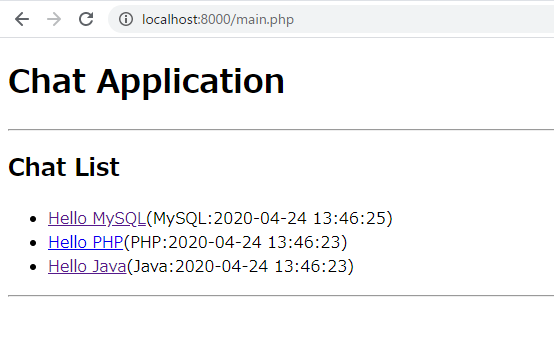
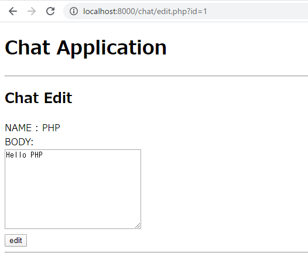
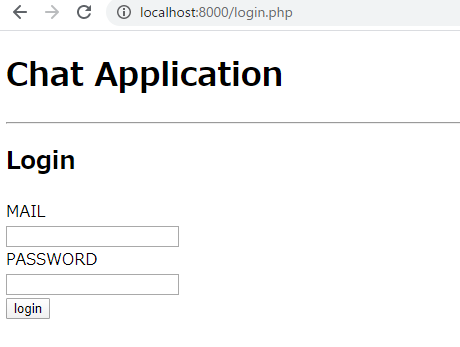

# PHP演習課題　Web編

認証機能付きのチャットアプリを作成します。以下の手順に従いながらアプリを完成させます。

## 準備

以下のようなデータベースを作成します。

- データベース名　：　exercise

- テーブル

    - users（ユーザーテーブル）

        | 列名 | データ | 型 | Primary Key |
        | --- | --- | --- | --- |
        | id | ユーザーID  | INT | 〇 |
        | mail | メールアドレス  | VARCHAR(255) |  |
        | name | ユーザー名  | VARCHAR(64) |  |
        | password | パスワード  | VARCHAR(64) |  |

    - conversations（会話テーブル）

        | 列名 | データ | 型 | Primary Key |
        | --- | --- | --- | --- |
        | id | 会話ID  | INT | 〇 |
        | user_name | ユーザー名  | VARCHAR(64) |  |
        | body | 本文  | VARCHAR(64) |  |
        | date | 投稿日  | VARCHAR(64) |  |

### SQL

```sql
create database exercise;
use exercise

create table users(
    id INT PRIMARY KEY AUTO_INCREMENT,
    mail VARCHAR(30),
    name VARCHAR(64),
    password VARCHAR(64)
);
insert into users(id, mail, name, password)values(1, 'php@test.jp', 'PHP', '20200424');
insert into users(id, mail, name, password)values(2, 'java@test.jp', 'Java', '20190424');
insert into users(id, mail, name, password)values(3, 'mysql@test.jp', 'MySQL', '20180424');

create table conversations(
    id INT PRIMARY KEY AUTO_INCREMENT,
    user_name VARCHAR(64),
    body VARCHAR(64),
    date DATETIME
);
insert into conversations(id, user_name, body, date)values(1, 'PHP', 'Hello PHP', now());
insert into conversations(id, user_name, body, date)values(2, 'Java', 'Hello Java', now());
insert into conversations(id, user_name, body, date)values(3, 'MySQL', 'Hello MySQL', now());
```

## 1. GET

以下の要件を満たす、`main.php`を作成せよ。

- `htpp://localhost/main.php`にアクセスすると画面が表示されること
- 会話テーブルの会話の一覧を表示する。
- 会話は、「本文（投稿者：投稿日時）」の形式で表示すること
- 会話は新しい順に画面の上部から表示すること
- 以下の画面イメージのような項目を表示すること


## 2. GET + GETパラメータ

以下の要件を満たす、`edit.php`を作成せよ。さらに`main.php`を変更せよ。

- main.php
    - 各会話の本文の部分をリンクにせよ
    - 各リンクをクリックすると、クリックされた会話のIDをURLパラメーターに設定し`edit.php`に遷移すること



- edit.php
    - リクエストから会話IDを取得すること
    - 会話テーブルからIDが一致する会話を取得すること
    - 取得した会話の本文をテキストボックスに表示すること
    - 以下の画面イメージのような項目を表示すること



## 3. POST + Redirect

以下の要件を満たす、`edit_controller.php`を作成せよ。また、`edit.php`を変更せよ。

- edit.php
    - 会話の編集を行う
    - 会話IDと本文をメッセージボディ部に格納して、`edit_controller.php`に送信すること

- edit_controller.php
    - 編集された会話の登録を行う
    - リクエストから、会話IDと本文を取得すること
    - 取得した会話IDの会話の本文を変更すること。その際変更を実行した日時を対象の会話のデータの`date`に格納すること。
    - 登録後は`main.php`に遷移すること。その際、画面を表示した際のURLは`htpp://localhost/main.php`となっていること。

## 4. 認証機能 + Session

ログイン認証機能を追加します。以下の要件を満たす、`login.php`と`login_controller.php`を作成せよ。
またこれまでに作成したファイルに対して認証機能を追加せよ。

- login.php
    - メールアドレスとパスワードを入力し、メッセージボディ部に格納して、`login_controller.php`に送信すること
    - 以下の画面イメージのような項目を表示すること



- login_controller.php
    - ログイン認証を行うこと
    - リクエストから、メールアドレスとパスワードを取得すること
    - 取得したメールアドレスとパスワードをもとに、`users`テーブルを検索すること
    - ユーザーを検索出来れば、ログイン成功とし、メールアドレスをセッションに格納し、`main.php`に画面遷移すること
    - ユーザーを検索できなければ、ログイン失敗とし、`login.php`に画面遷移すること

- main.php, edit.php
    - 認証機能を追加する
    - セッションからメールアドレスを取得できない場合は、各画面を表示せずログイン画面に遷移すること

- edit_controller.php
    - 認証機能を追加する
    - セッションからメールアドレスを取得できない場合は、登録処理を行わずログイン画面に遷移すること

## 5. 会話投稿機能

会話投稿機能を追加せよ。

- `main.php`に投稿画面に遷移するリンクを配置せよ
- 投稿画面では、ユーザー名と本文を入力できること
- 投稿画面に遷移するにはログインしている必要があり、ログインしていない場合はログイン画面に遷移すること
- 会話を投稿するにはログインしている必要があり、ログインしていない場合はログイン画面に遷移すること
